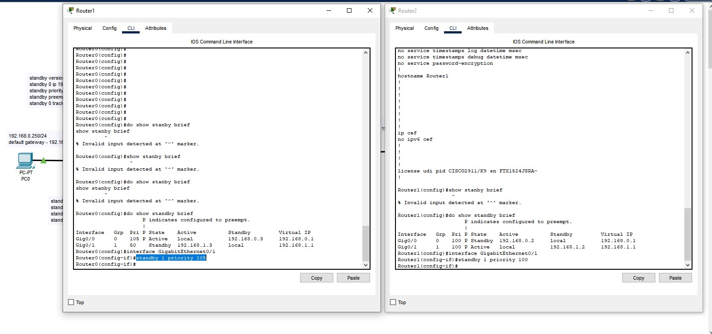

# Домашнее задание к занятию Disaster-recovery-Keepalived - Николаев Евгений
### Задание 1
- Дана [схема](1/hsrp_advanced.pkt) для Cisco Packet Tracer, рассматриваемая в лекции.
- На данной схеме уже настроено отслеживание интерфейсов маршрутизаторов Gi0/1 (для нулевой группы)
- Необходимо аналогично настроить отслеживание состояния интерфейсов Gi0/0 (для первой группы).
- Для проверки корректности настройки, разорвите один из кабелей между одним из маршрутизаторов и Switch0 и запустите ping между PC0 и Server0.
- На проверку отправьте получившуюся схему в формате pkt и скриншот, где виден процесс настройки маршрутизатора.

------

### Выполнения задания 1

[Схема решения](file/hsrp_advanced_my.pkt)

------

### Задание 2
- Запустите две виртуальные машины Linux, установите и настройте сервис Keepalived как в лекции, используя пример конфигурационного [файла](1/keepalived-simple.conf).
- Настройте любой веб-сервер (например, nginx или simple python server) на двух виртуальных машинах
- Напишите Bash-скрипт, который будет проверять доступность порта данного веб-сервера и существование файла index.html в root-директории данного веб-сервера.
- Настройте Keepalived так, чтобы он запускал данный скрипт каждые 3 секунды и переносил виртуальный IP на другой сервер, если bash-скрипт завершался с кодом, отличным от нуля (то есть порт веб-сервера был недоступен или отсутствовал index.html). Используйте для этого секцию vrrp_script
- На проверку отправьте получившейся bash-скрипт и конфигурационный файл keepalived, а также скриншот с демонстрацией переезда плавающего ip на другой сервер в случае недоступности порта или файла index.html

------

### Выполнения задания 2

[Получившейся bash-скрипт](file/check.sh)

[Конфигурационный файл keepalived](file/keepalived.conf)

Сервер nginx на 192.168.56.10 работает

Сервер nginx на 192.168.56.15 работает

Плавающий IP-адрес 192.168.56.100 ссылается на 192.168.56.10

Скриншот сетевого интерфейса машины 192.168.56.10, где присутствует плавиющий IP-адрес

Скриншот сетевого интерфейса машины 192.168.56.15, где отсутствует плавиющий IP-адрес

Изменим название файла, на который ссылается скрипт 

На сервере nginx ошибка

Плавающий IP-адрес 192.168.56.100 ссылается на 192.168.56.15

Скриншоты сетевых интерфейсов, где мы видим, что плавающий IP-адрес появился на 192.168.56.15 интерфейсе

